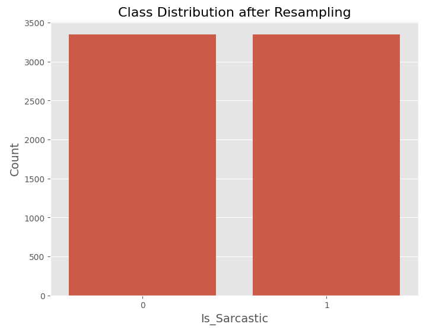
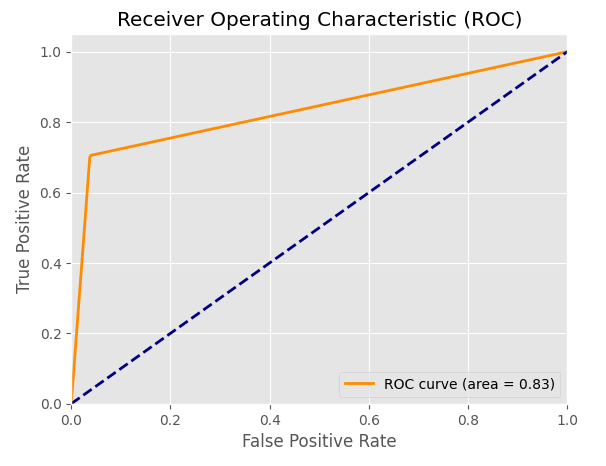

# 🤖 Sarcasm Detection using Machine Learning

A Natural Language Processing (NLP) project that automatically classifies text as **Sarcastic** or **Non-Sarcastic**. The project performs extensive text preprocessing, feature extraction using TF-IDF, handles class imbalance with SMOTE, and compares multiple machine learning models including Logistic Regression, Support Vector Machine, Decision Tree, and K-Nearest Neighbors.

---

## 📌 Overview

Sarcasm detection is a challenging NLP task because sarcastic statements often express sentiments opposite to their literal meaning. This project uses machine learning techniques to identify sarcasm in social media text and compares the performance of different classifiers.

---

## ✨ Features

* Data cleaning and preprocessing
* Tokenization using NLTK
* Stemming and Lemmatization
* TF-IDF feature extraction
* Handling class imbalance using SMOTE
* Multiple machine learning models
* Model comparison
* ROC-AUC evaluation
* Classification reports and confusion matrices
* Visualization of class distributions

---

## 🛠 Tech Stack

* Python
* Pandas
* NumPy
* NLTK
* Scikit-Learn
* Imbalanced-Learn (SMOTE)
* Matplotlib
* Seaborn
* Google Colab


---

# 📊 Dataset

The dataset consists of social media posts labeled as:

| Label | Meaning       |
| ----- | ------------- |
| YES   | Sarcastic     |
| NO    | Non-Sarcastic |

### After preprocessing:

* Total samples = **5250**
* Labels encoded as:

```python
YES → 1
NO  → 0
```

---

# 🔄 Workflow

## 1. Dataset Preparation

* Merge tweet and label files.
* Remove duplicate entries.
* Remove missing values.

---

## 2. Text Preprocessing

The following preprocessing steps are performed:

* Convert text to lowercase
* Remove URLs
* Remove mentions (@user)
* Remove special characters
* Remove emojis
* Tokenization
* Stemming using Porter Stemmer
* Lemmatization using WordNet Lemmatizer

---

## 3. Feature Extraction

TF-IDF Vectorization:

```python
from sklearn.feature_extraction.text import TfidfVectorizer

tfidf_vectorizer = TfidfVectorizer(max_features=1000)
X_tfidf = tfidf_vectorizer.fit_transform(X)
```

---

## 4. Train-Test Split

```python
from sklearn.model_selection import train_test_split

X_train, X_test, y_train, y_test = train_test_split(
    X_tfidf,
    y,
    test_size=0.3,
    random_state=42
)
```

---

## 5. Handling Class Imbalance

SMOTE (Synthetic Minority Oversampling Technique) was used.

### Before SMOTE

| Class             | Samples |
| ----------------- | ------- |
| Non-Sarcastic (0) | 3351    |
| Sarcastic (1)     | 324     |

### After SMOTE

| Class             | Samples |
| ----------------- | ------- |
| Non-Sarcastic (0) | 3351    |
| Sarcastic (1)     | 3351    |

---

# 🤖 Models Used

## 1. Logistic Regression

```python
LogisticRegression(random_state=42)
```

### Results

* Accuracy : **94.54%**

---

## 2. Support Vector Machine (SVM)

```python
SVC(kernel='linear')
```

### Results

* Accuracy : **94.03%**

---

## 3. Decision Tree

```python
DecisionTreeClassifier(random_state=42)
```

### Results

* Accuracy : **93.27%**


## 4. K-Nearest Neighbors (KNN)

```python
KNeighborsClassifier(n_neighbors=5)
```

### Results

* Accuracy : **87.17%**


# 📈 Model Comparison

| Model                  | Accuracy   |
| ---------------------- | ---------- |
| Logistic Regression    | **94.54%** |
| Support Vector Machine | 94.03%     |
| Decision Tree          | 93.27%     |
| KNN                    | 87.17%     |

🏆 **Best Performing Model: Logistic Regression**

---

# 📉 ROC Curve

The ROC curve was generated to evaluate the classifier's ability to distinguish between sarcastic and non-sarcastic tweets.

**AUC Score = 0.8337**
# 📷 Results

### Class Distribution After SMOTE



### ROC Curve



---


# 👩‍💻 Author

### **Anushka Goyal**

B.Tech CSE-AI, IGDTUW

* Artificial Intelligence
* Machine Learning
* NLP


🔗 **GitHub:**
[https://github.com/Anushka-dev707](https://github.com/Anushka-dev707)


